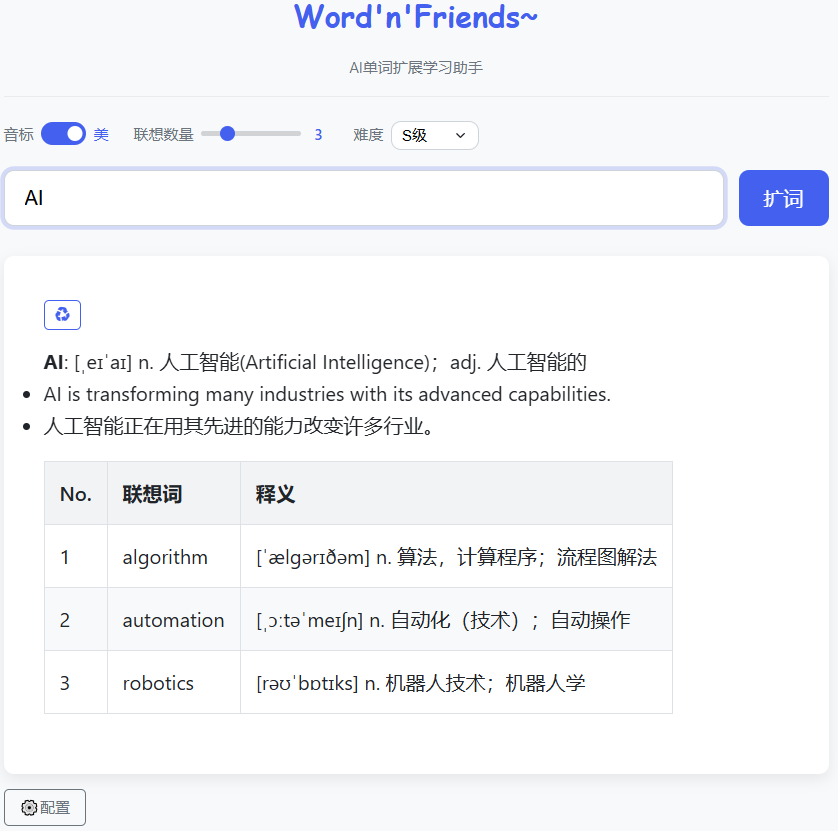

# Word'n'Friends

单词扩展学习AI助手

## 项目介绍

Word'n'Friends 是一个基于语言模型AI的英语词汇学习助手，旨在帮助学习者通过单词联想扩展词汇量。



## 功能特点

- **中英互译**：支持中文和英文单词输入，自动识别并处理
- **智能联想**：根据输入单词生成相关联想词，拓展词汇量
- **详细释义**：提供每个联想词的词性、音标、中文释义
- **难度调节**：支持从高中到托福级别的多种难度选择
- **自定义配置**：允许配置自己的 API 接口和模型
- **流式响应**：支持流式生成，实时显示结果

## 设置

### API密钥配置

首次使用前，需要设置API密钥：

1. 复制 `defaultConfigs.template.js` 为 `defaultConfigs.js`
2. 在 `defaultConfigs.js` 中填入您的API密钥
3. 这个文件不会被提交到版本控制系统，确保您的密钥安全

```javascript
// 示例配置
const DEFAULT_CONFIGS = [
    {
        id: "siliconflow",
        name: "硅基流动/DeepSeek",
        baseUrl: "https://api.siliconflow.cn/v1/chat/completions",
        model: "deepseek-ai/DeepSeek-V3",
        apiKey: "您的API密钥", // 替换为您的实际密钥
        isDefault: true
    }
];
```

### 开发

项目结构说明：
- `defaultConfigs.template.js`: API配置模板，可提交到版本控制
- `defaultConfigs.js`: 实际API配置（本地使用，不应提交）
- `configs.js`: 配置管理功能
- `script.js`: 主应用逻辑
- `quoteFetcher.js`: 每日一句功能
- `wordService.js`: 单词查询服务

## 使用说明

- 在输入框中输入中文或英文单词
- 点击"扩词"按钮或按 Enter 键提交
- 系统将生成该单词的详细释义、例句及相关联想词
- 选择词汇难度，从 B 级（中学基础）到 SSS 级（托福水平）

## 自定义配置

点击界面底部的"⚙️配置"按钮，可以设置使用自己的模型配置。

## 许可证

MIT 许可证
